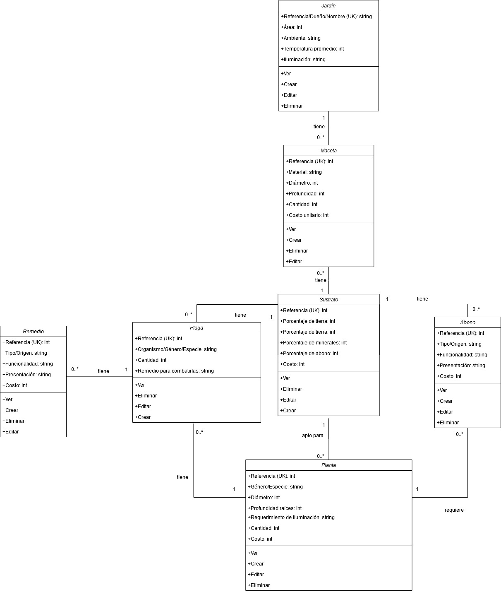

# Sistema de Jardines

_Sistema para el diseño de jardines, incluye costos pero aún no calcula costo total_

## Autores

* **Sara Duque Martínez** - saduquema@unal.edu.co_

* **Daniel Alejandro Giraldo Giraldo** - Dgiraldogi@unal.edu.co_

* **Cristian Jhonney Beltrán Morales** - cjbeltranmo@unal.edu.co_

### Pre-requisitos 📋

_Link repositorio GitHub: https://github.com/saduquema/trabajo-1-estructura-de-datos_

## Construido con 🛠

_Se empleó Java, Maven y la librería JSON simple_

* [Maven](https://maven.apache.org/) - Manejador de dependencias

### Comenzando 🚀

_El sistema pide al usuario autenticarse, se puede usar los siguientes:_

_No es necesario ingresar documento y correo, solo uno de los dos_

* **Documento:** 100 o **Correo:** sara@gmail.com, **Contraseña:** 1234 

## Diagrama de clases 📖

_Clases en el sistema:_

* Jardín
* Maceta
* Sustrato
* Planta
* Abono
* Plaga
* Remedio

